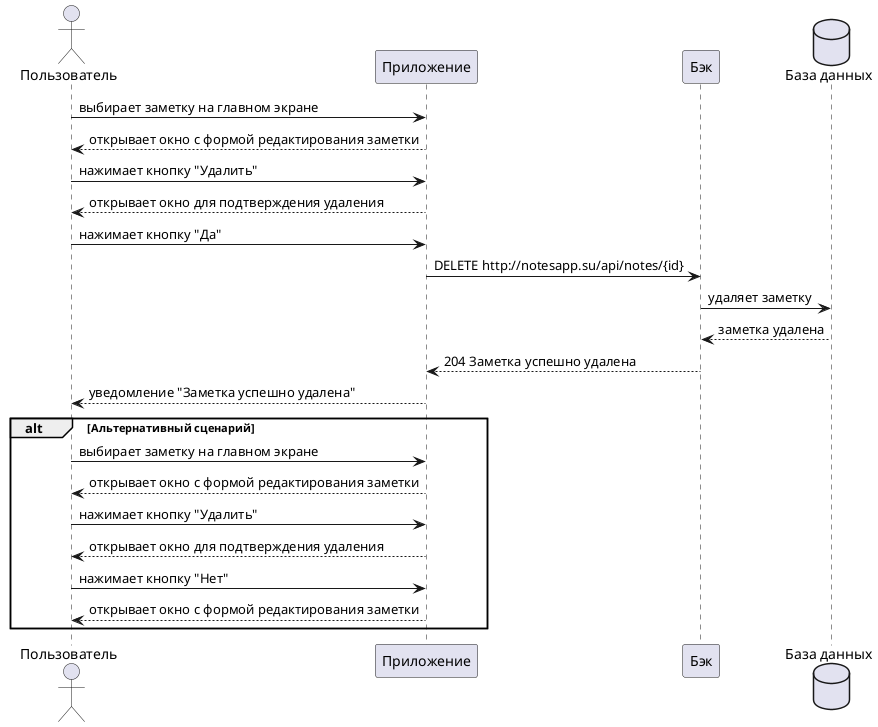

# Пользовательский сценарий «Удаление созданной заметки»

## Действующие лица:

1. Пользователь

2. Приложение

3. Бэк

4. База данных

## Предварительные условия

1. Пользователь должен находиться на главном экране.

2. Пользователь создал хотя бы одну заметку.

## Выходные условия

В системе удалена выбранная заметка пользователя.

## Основной сценарий

1. Пользователь выбирает заметку на главном экране.

2. Приложение открывает окно с формой редактирования заметки.

3. Пользователь нажимает кнопку **Удалить**.

4. Приложение открывает окно для подтверждения удаления.

5. Пользователь нажимает кнопку **Да**.

6. Приложение отправляет запрос `DELETE http://notesapp.su/api/notes/{id}` Бэку на удаление заметки.

7. Бэк удаляет заметку из Базы данных.

8. Бэк возвращает Приложению ответ `204	Заметка успешно удалена` об успешном удалении заметки.

9. Приложение открывает пользователю уведомление «Заметка успешно удалена».

## Альтернативный сценарий

1. Пользователь выбирает заметку на главном экране.

2. Приложение открывает окно с формой редактирования заметки.

3. Пользователь нажимает кнопку **Удалить**.

4. Приложение открывает окно для подтверждения удаления.

5. Пользователь нажимает кнопку **Нет**.

6. Приложение открывает окно с формой редактирования заметки.

## Диаграмма последовательности

